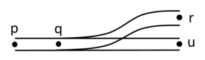
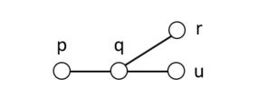
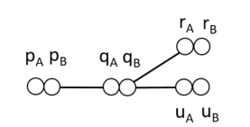
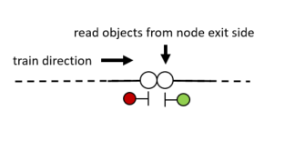

# Infrastructure

The `rolling` infrastructure model uses a double node graph model. To understand the motivation for the double node graph, consider the 
railway junction in the figure below.



On the railway network, paths p-q-r and p-q-u exist, in both directions. However, in a conventional undirected graph representation, there would also be a path r-q-u.



When we extend the graph concept to include two sides of each node, there is no longer a path r-q-u.



So, the double node graph is similar to a graph, with the difference that each node has two sides. A train entering a node from an edge connected to one side of the node can only exit the node through edges on the opposide side of the node. 

This model allows a sense of *local directedness* without deciding on a global direction concept such as up/down or outgoing/incoming often used in railway engineering. A global directionality requires considering special cases to handle railway networks where 
a train's up/down direction may change without the train reversing its direction, such as the [balloon loop example](examples/baloon.md).

Each side of the node may have a set of *objects*, which are read by a passing train on the **exit side** of the node, i.e. the opposite side of the node from the edge on which the train entered.



## Input format

The DGraph input file format consists of statements separated by whitespace which describe the double nodes, both sides together, and various edge types with corresponding lengths.

## Nodes

The syntax for describing nodes is as follows:

```haskell
node <name>[(<objects>)]-<name>[(<objects>)]
```

Examples:
```haskell
node n1-n2
node n2-n3(signal s1)
node n3(enter sec1)-n4
```


## Edges

Edges are either **linear**, **switches** or **boundaries**. Each node may only be mentioned in one edge statement. Nodes which are not mentioned in edge statements are assumed to be the end of a track.

### Linear

Linear edges simply connect two nodes by a length of track using the syntax `linear <node>-<node> <distance>`.

Example:
```haskell
linear n1-n2 124.5
```

### Switches

Switches 
Currently, only two-way switches are supported.

Example:
```haskell
switch sw1 left n1-(n2 200.0, n3 220.0)
```

### Boundaries

Boundaries are nodes where a train may enter or leave the model. When entering, the train's front simply appears at the node, while the body of the train is still outside of the model. When leaving, the front of the train visits the boundary node and the train travels on until the back of the train visits the boundary node, after which the train is considered to be finished.

The name of the boundary node is used in dispatch plans and in route files to refer to the location of the model boundary.

The syntax is `boundary <node>`.

Example:
```haskell
boundary n1
```

## Objects

Each node may contain zero or more objects, which appear within the parentheses after the node name in the `node` statement.

The possible object types are:

* **Signals**: a signal with the given name is located at the current node. Note that this has no actual impact on trains, as only the `sight` statements can add the signal to the train's communication list. This statement is used for visualization purposes.
  
  Syntax: `signal <name>` 
  
  Example: `signal sig1`

* **Enter section**: a train whose front passes the current node will enter a detection section. Note that a train detector (e.g. axle counter) or a track circuit border will typically need to be translated into four `enter`/`exit` statements, an `enter` for the section on each side of the detector, and an `exit` for each section on the opposite sides. The rationale for this representation is that it is a low-level instruction that the train can simply read and execute, and that is allows for more exotic train detection setups, such as overlapping sections.

  Syntax: `enter <section-name>` 
  
  Example: `enter section1`

* **Exit section**: a train whose back passes the current node will exit a detection section.

  Syntax: `exit <section-name>` 
  
  Example: `exit section1`

* **Sight**: after visiting the current node, trains can *see* a given signal for a given travel distance. Typically, this node will appear at a given distance before a signal, and the given distance will be the travel distance from the sight object's node to the signal.

  Syntax: `sight <signal-name> <distance>` 
  
  Example: `signal sig1 400.0`

*Switches* may also be considered to be objects, but appear in their own statements since they also relate nodes (see the [switches section](#switches)).

An example of various objecs on a double node statement:

```haskell
node n1(enter section1, exit section2)
    -n2(signal sig1, sight sig2 800.0, exit section1, enter section2)
```
