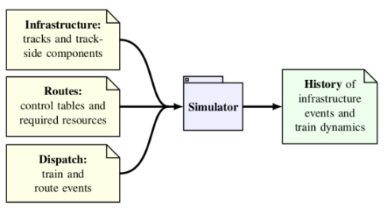

# Dispatch mode (simulation)


## Command-line interface

```
Rolling -- simple railway simulation

USAGE:
    rolling [FLAGS] [OPTIONS] <infrastructure> <routes> <dispatch>

FLAGS:
    -h, --help       Prints help information
    -V, --version    Prints version information
    -v, --verbose    Verbose mode (-v, -vv)

OPTIONS:
    -f, --format <format>            Output format profile: full | timing
    -g, --graphical <graphical>      Output directed graph for graphical conversion
    -J, --javascript <javascript>    Output JSON history as JavaScript
    -j, --json <json>                Output JSON history file
    -n, --visits <visits>            Output node visit times to file

ARGS:
    <infrastructure>    Static infrastructure file in the Rolling D-Graph format
    <routes>            Route file in the Rolling Route format
    <dispatch>          Dispatch file in the Rolling Dispatch format
```

## Model



The input model for `rolling` consists of three main components:

 * The **[infrastructure](./dgraph.html) 🌍** model contains the tracks, movable elements, and
   signalling and interlocking components which are needed to do a
   running time analysis of railway dispatching.
 * The **[interlocking](./routes.html) 🔒** model describes the elementary routes that can
   be dispatched.
 * The **[dispatch](./dispatch.html) 👋** list contains times of train and route setting.

`rolling` uses these components together to calculate a 
**[history 📈](./history.html)** 
of events, which contains the state of the infrastructure at each point in time, and the dynamics of the trains as they move on the infrastructure.

Each of these are described in more detail in their respective sections.
