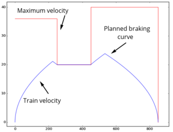
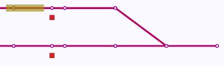
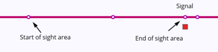

# Rolling

**Rolling** is a *fast* railway performance analysis tool for use in **construction project verfication**.

## Features

Rolling consists of two components: dispatch mode (simulation) and verification mode (planning). The components may be used separately for different purposes, or together, to provide analysis of dynamic behavior and incrementally verify performance in a railway design and construction project.

### Dispatch mode

The `rolling` dispatch mode is a [discrete event simulation](https://en.wikipedia.org/wiki/Discrete_event_simulation)
which models the behavior of trains and infrastructure.
Discrete event simulation is an event-based simulation approach where
a set of processes are able to wait for events from each other, or wait for time to pass.
When a process waits for time to pass, it is inserted into a priority queue, and the
simulation clock is advanced up to the next pending process' activation time.

The main processes types in the `rolling` simulation are trains and routes. 
Routes are further divided into an activation process, movable element processes (switching),
a release trigger process, and a signal trigger process.
The route processes model the workings of the dispatch and interlocking systems, while
the train process models the workings of the train, the driver, onboard protection systems 
and communcations.

A dispatch plan (1) is executed by sending commands to the interlocking controller (2), which communicates movement authority to the trains (3).

Rolling calculates train trajectories with a given dispatch plan using an infrastructure and interlocking controller model with the following features:

* **Topology and lengths** -- trains travel on a model of the railway network with given distances, guided by switches and other movable track elements.

  
* **Laws of motion** -- trains move within the limits of given maximum acceleration and braking power. A train driver model is used to plan ahead for braking so that the train respects its given movement authority.

  
* **Allocation of resources** -- a resource-based model of the interlocking ensures that conflicting routes are not communicated to the trains. Requested movement may be queued so that the dispatch happens as soon as resources are available.

  
* **Communication** -- traditional optical signalling and automatic train protection systems impose a communication constraint which may be the cause of lower performance. Rolling's communication model is suitable for optical signalling, point-based and linear traditional train protection systems, and radio-based communications such as ETCS.

  

### Verification mode

The verification mode (the `railperfcheck` program) 
produces a dispatch plan which fulfils 
a performance specification. The specification may include 
requirements on the infrastructure such as running time, 
train frequency,
parking, crossing, overtaking, and simultaneous combinations of these.
Specifications work by listing locations that a train needs to visit, 
and optionally setting the maximum time between pairs of such visits.

The dispatch plan is produced by a planning procedure using 
automated reasoning techniques, which efficiently finds a
sequence of route activations which takes the trains where they
need to go, and can show a complete list of alternative 
route sequences for achieving the goal.
 The `railperfcheck` program does the work of the dispatcher
on a railway station or a remote control facility.

When not only location visit contraints, but also 
timing constraints are specified,
suggested plans are automatically sent to the `rolling` dispatch 
simulator, and the timing of location visits are measured.
If one plan fails, `railperfcheck` will find more plans until 
one or more of them satify all requirements.

The verification mode allows fully automated verification
of performance properties, using minimal input documentation.
This allows construction projects to 
bring in performance verification into
frequently changing early-stage design projects, avoiding the
costly and time-consuming backtracking required when later-stage
analysis reveals unacceptable performance.

* **Specification format** -- specify performance properties in a high-level format, avoiding unneccesary details such as specific tracks, signals, and routes. This saves effort and is especially useful when these details are unknown or subject to change, as is the case in construction projects.
* **Smart planning** -- solve complicated maneuvering puzzles automatically.

  
* **Full automation** -- meaning that as your track and component layout changes during the project, performance specifications can be verified again with no extra effort. Errors which would cause operational problems can be caught immediately.

