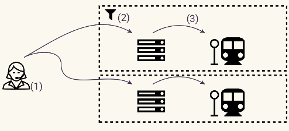
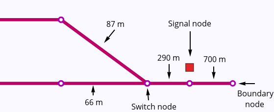
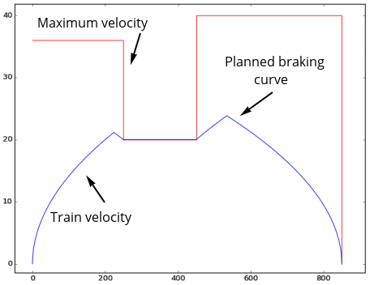
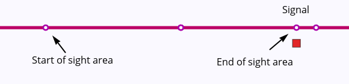
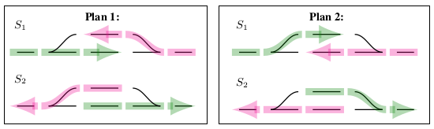
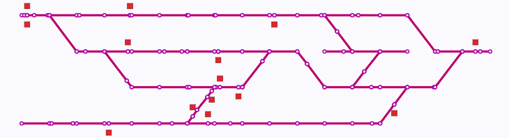

# Rolling

**Rolling** is a *fast* railway performance analysis tool for use in **construction project verfication**.

## Features

### Dispatch mode

The dispatch plan (1) is executed by sending commands to the interlocking controller (2), which communicates movement authority to the trains (3).

Rolling calculates train trajectories with a given dispatch plan using an infrastructure and interlocking controller model with the following features:

* **Topology and lengths** -- trains travel on a model of the railway network with given distances, guided by switches and other movable track elements.

  
* **Laws of motion** -- trains move within the limits of given maximum acceleration and braking power. A train driver model is used to plan ahead for braking so that the train respects its given movement authority.

  
* **Allocation of resources** -- a resource-based model of the interlocking ensures that conflicting routes are not communicated to the trains. Requested movement may be queued so that the dispatch happens as soon as resources are available.

  
* **Communication** -- traditional optical signalling and automatic train protection systems impose a communication constraint which may be the cause of lower performance. Rolling's communication model is suitable for optical signalling, point-based and linear traditional train protection systems, and radio-based communications such as ETCS.

  

### Verification mode

Check that performance requirements are satisfied. Fully automated planning produces a dispatch plan which satisfies the requirements, or reports that no such plan exists.

* **Specification format** -- specify performance properties at a "high level", meaning that unneccesary details, such as specific tracks, signals, and routes, are left out. This saves effort and is especially useful when these details are unknown or subject to change, as is the case in construction projects.
* **Smart planning** -- solve complicated maneuvering puzzles automatically.

  
* **Full automation** -- meaning that as your track and component layout changes during the project, performance specifications can be verified again with no extra effort. Errors which would cause operational problems can be caught immediately.

## Use case

For construction projects, where the track layout plan is under development, Rolling provides:

 * Detailed analysis of capacity bottlenecks. 
 * Regression testing after project changes. 
