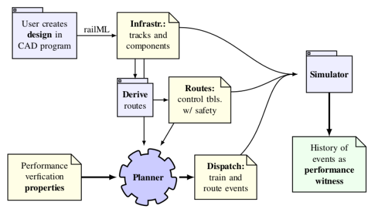

# Verification mode (planner)

## Command-line interface

```
railperfcheck v0.1.0

railperfcheck [OPTIONS] INFRFILE ROUTESFILE USAGEFILE

Common flags:
  -p --planoutput=FILE        Output dispatch of successful plan
  -r --resultjsonoutput=FILE  Output constraint checklist in JSON format
  -? --help                   Display help message
  -V --version                Print version information
     --numeric-version        Print just the version number

```

## Model



The required inputs to the `railperfcheck` planner are:

* The `INFRFILE` argument takes a file name with the same format as
the [**infrastructure 🌍**](./dgraph.html)
 model described in the dispatch mode.
* The `ROUTESFILE` argument takes a file name with the same format the 
[the **interlocking 🔒** ](./routes.html)
 model described in the dispatch mode.
* The `USAGEFILE` argument takes a filename with the 
high-level 
[**usage 📆**](./usage.html)
specifications.

The program uses the routes file to plan movements where trains perform their required visits, and uses the infrastructure and routes together with the `rolling` simulator mode to check whether these movements satisfy any timing constraints.

The output of the program may be:
 * Unsuccessful: a dispatch which satisfied the requirements could not be found within the bound on number of steps.
 * Successful: 
a [**dispatch 👋**](./dispatch.html) 
file is produced which may be used together with [`rolling`](./model.html) to obtain the 
[**history 📈**](./history.html) 
of events which *proves* that the infrastructure can be used according to the the usage specification.
